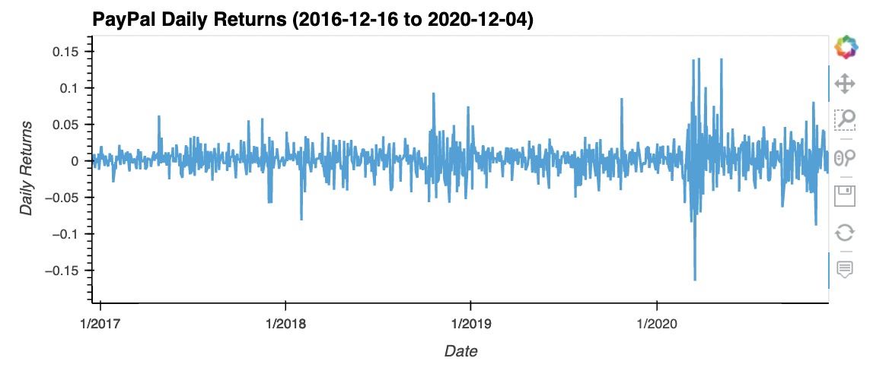
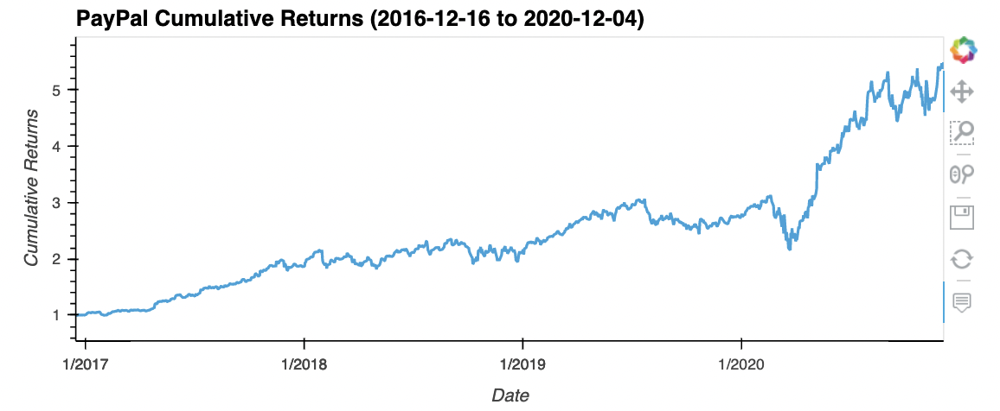
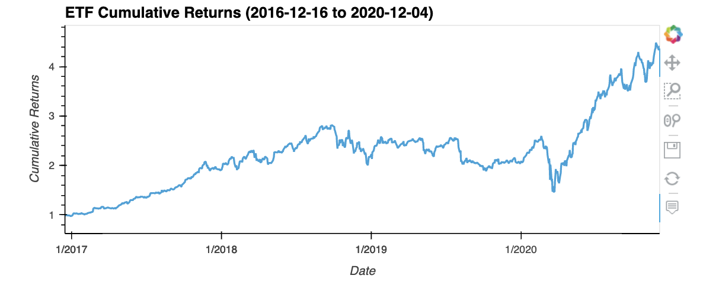

# ETF-Analyzer

Financial Database and Web Application using SQL, Python, and Voilà library to analyze the performance of a hypothetical ETF.

---

## Technologies

This project leverages python 3.7 with the following:

* [JupyterLab](https://jupyterlab.readthedocs.io/en/stable/) - JupyterLab is a web-based user interface designed for data analysis.

* [pandas](https://github.com/pandas-dev/pandas) - Flexible and powerful data analysis / manipulation library for Python.

* [numpy](https://github.com/numpy/numpy) - The fundamental package for scientific computing with Python.

* [sqlalchemy](https://pypi.org/project/SQLAlchemy/) - Object Relational Mapper that gives the full power and flexibility of SQL.

---

### Installation Guide

Before running the application first install the following dependencies.

```python
  pip install jupyterlab
  pip install pandas
  pip install numpy
  pip install sqlalchemy
```

---

## Examples

** Writing a SQL SELECT statement that reads all the PYPL data from the database. Reads the PYPL data from the database into a Pandas DataFrame. **
```
# Write a SQL query to SELECT all of the data from the PYPL table
query =  """
SELECT * 
FROM PYPL
"""

# Use the query to read the PYPL data into a Pandas DataFrame
pypl_dataframe = pd.read_sql_table('PYPL', con=engine)

```
** Using hvPlot to create an interactive visualization for the PYPL daily returns. **
```
# Create an interactive visualization with hvplot to plot the daily returns for PYPL.
pypl_dataframe[['time', 'daily_returns']].hvplot(
    x='time', y='daily_returns', xlabel='Date', ylabel='Daily Returns',
    title="PayPal Daily Returns (2016-12-16 to 2020-12-04)")

```

** Calculating annualized returns for the portfolio and displaying result. **
```
# Create a DataFrame that displays the mean value of the “daily_returns” columns for all four assets.
etf_portfolio_returns = etf_portfolio['daily_returns'].mean(axis=1)

# Use the average daily returns provided by the etf_portfolio_returns DataFrame 
# to calculate the annualized return for the portfolio. 
annualized_etf_portfolio_returns = etf_portfolio_returns.mean() * 252

# Display the annualized return value of the ETF portfolio.
print(f"The Annualized Return of the Portfolio is {annualized_etf_portfolio_returns*100:.2f}%")

```

** Using hvPlot to create an interactive visualization for the cumulative return values of the ETF portfolio. **
```
# Using hvplot, create an interactive line plot that visualizes the ETF portfolios cumulative return values.
etf_cumulative_returns = pd.DataFrame(etf_cumulative_returns)
etf_cumulative_returns.columns = ['cumulative_returns']
etf_cumulative_returns = etf_cumulative_returns.join(pypl_dataframe['time'])

#etf_cumulative_returns

etf_cumulative_returns.hvplot(
    x='time', y='cumulative_returns', xlabel='Date', ylabel='Cumulative Returns',
    title="ETF Cumulative Returns (2016-12-16 to 2020-12-04)")

```

---

## Usage

To use the etf_analyzer application simply clone the repository and run the **etf_analyzer.ipynb** with:

```python
python etf_analyzer.ipynb
```

Below you will find screenshot demonstrations.







---

## Contributors

Brought to you by Robert Giannini.
LinkedIn: https://www.linkedin.com/in/robertgianninijr/

---

## License

MIT 
 

